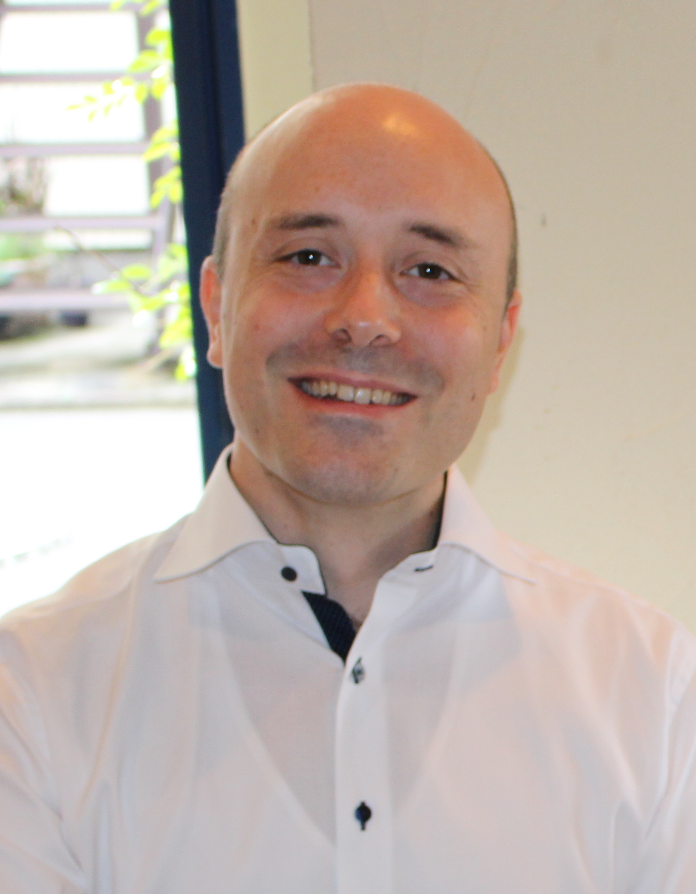

Aside
================================================================================

{width=70%}

<i class="fa fa-comments"></i> Contact Info {#contact}
--------------------------------------------------------------------------------

- <i class="fa fa-envelope"></i> pierre.jonniaux@gmail.com
- <i class="fa fa-github"></i> [github.com/pierre-jonniaux](https://github.com/pierre-jonniaux)
- <i class="fa fa-linkedin"></i> [linkedin.com/in/pierre-jonniaux](https://www.linkedin.com/in/pierre-jonniaux-41890b161)
- <i class="fa fa-phone"></i> +33 (0)2 2127 1858
- <i class="fa fa-phone"></i> +33 (0)7 8050 3502

<i class="fa fa-keyboard"></i> Skills {#skills}
--------------------------------------------------------------------------------

- Microarray analysis
- Phylogeny analysis
- Python
- R
- Perl  
- GNU/Linux

 <i class="fa fa-language"></i> Languages {#skills}
--------------------------------------------------------------------------------
- French
- English
- Japanese

Main
================================================================================

Pierre Jonniaux {#title}
--------------------------------------------------------------------------------

### Currently searching for a data analyst position

After a master in biology and a specialization in bioinformatics I went abroad and did a PhD. in molecular phylogeny in Japan. Then I worked over there as a data analyst in charge of microarray analysis.  
After a detour by the education field, I took the opportunity to come back to EU where I am in search of a job that will need my expertise in bioinformatics.  
I recently finished a data science specialization focused on R programming and am still following several courses to keep my programming skills up-to-date.

Education {data-icon=graduation-cap data-concise=true}
--------------------------------------------------------------------------------

### Johns Hopkins University via Coursera

Data Science Specialization

E learning

2022

::: concise
- R programming.
- Biostatistics.
- Regression analysis.
- Machine learning.
- Version control (Git).
- Data product development (Shiny).
- Natural Language Processing.
:::

### Michigan University via Coursera

Python 3 specialization

E learning

2022

### Rice University via Coursera

Programming and algorithmic

E learning

2020

### Le Mans University - Tokyo French institute 

University Diploma in French as a Foreign Language (DUFLE)

Tokyo, Japan

2014

### Nagoya University

PhD in biological sciences

Nagoya, Japan

2012

::: concise
- Genome sequencing.
- Phylogenetic analysis (MrBayes, PAUP*, Multidivtime...).
- Genome annotation.
- Analysis pipelines in Perl (Bioperl, Bio-phylo toolkit).
:::

### Free University of Brussels (ULB)

Postgraduate diploma in bioinformatics

Brussels, Belgium

2004

### Free University of Brussels (ULB)

Master in Animal Biology

Brussels, Belgium

2002

### Free University of Brussels (ULB)

Bachelor in Biological Sciences

Brussels, Belgium

2000

Professional Experience {data-icon=suitcase}
--------------------------------------------------------------------------------

### French language teacher

Nagoya University of Foreign Studies

Nagoya, Japan

2019 - 2015

::: concise
- Communication classes. 
- French society and culture classes.
- French language manual redaction.
- Study abroad program assistant.
:::

### Data analyst

Biomatrix, Inc.

Nagareyama, Japan

2015 - 2013

::: concise
- Affymetrix and Agilent microarray data analysis.
- Analysis pipelines and automation in Python.
- Pathway analysis using Genespring GX.
- Redaction of customers reports (Japanese and English). 
- Company website and promotional material translation.
:::

Publications {data-icon=book}
--------------------------------------------------------------------------------

### Mitochondrial genomes of two African geckos of genus Hemitheconyx (Squamata: Eublepharidae).  

Mitochondrial DNA. 2012 Aug;23(4):278-9.

N/A

N/A

Jonniaux P, Hashiguchi Y, Kumazawa Y.

### Molecular phylogenetic and dating analyses using mitochondrial DNA sequences of eyelid geckos (Squamata: Eublepharidae).

Gene. 2008 Jan 15;407(1-2):105-15.

N/A

N/A 

Jonniaux P, Kumazawa Y.

