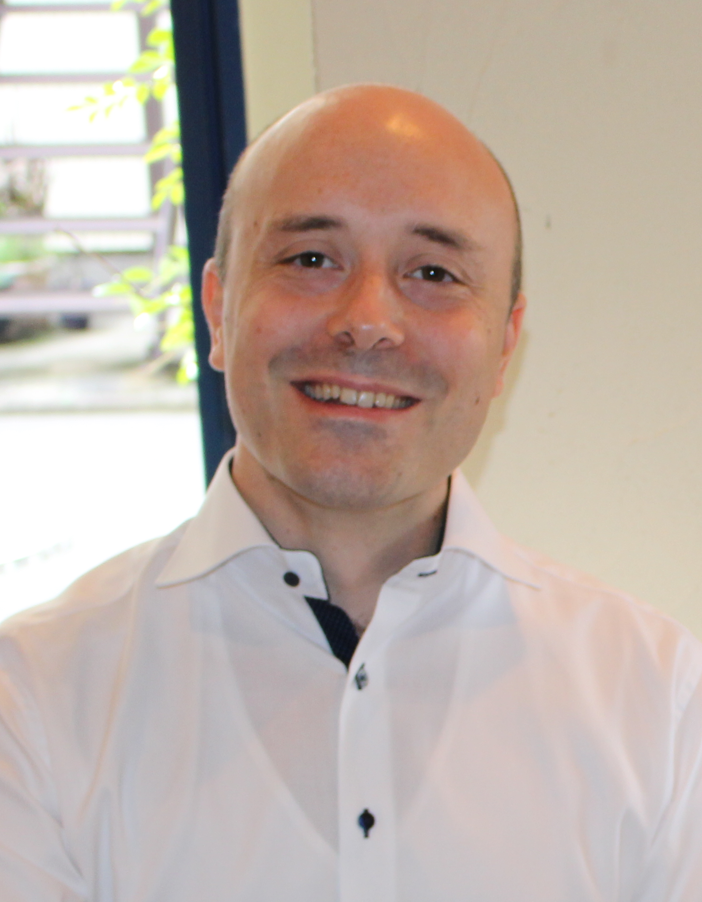

Aside
================================================================================

{width=70%}

<i class="fa fa-comments"></i> Contact {#contact}
--------------------------------------------------------------------------------

- <i class="fa fa-envelope"></i> pierre.jonniaux@gmail.com
- <i class="fa fa-github"></i> [github.com/pierre-jonniaux](https://github.com/pierre-jonniaux)
- <i class="fa fa-linkedin"></i> [linkedin.com/in/pierre-jonniaux](https://www.linkedin.com/in/pierre-jonniaux-41890b161)
- <i class="fa fa-phone"></i> 02 21 27 18 58
- <i class="fa fa-phone"></i> 07 80 50 35 02

<i class="fa fa-keyboard"></i> Compétences {#skills}
--------------------------------------------------------------------------------

- Analyse de micro-array
- Analyse phylogénétique
- Python 
- R
- Perl  
- GNU/Linux

 <i class="fa fa-language"></i> Langues {#skills}
--------------------------------------------------------------------------------
- Français
- Anglais
- Japonais

Main
================================================================================

Pierre Jonniaux {#title}
--------------------------------------------------------------------------------

### Actuellement à la recherche d'un poste de bioinformaticien

Suite à un master en biologie et un DES en bioinformatique, j'ai fait au Japon un doctorat en phylogénie moléculaire. J'ai ensuite travaillé là-bas comme bioinformaticien en charge d'analyses de micro-array.  
Après un passage dans l'enseignement universitaire, j'ai eu l'occasion de retourner en France où je recherche un travail qui fera appel à mes compétences en bioinformatique.  
Je viens de finir une spécialisation en programmation R et science des données et poursuis actuellement d'autres formations afin de maintenir mes compétences à jour et les développer plus avant.

Éducation {data-icon=graduation-cap data-concise=true}
--------------------------------------------------------------------------------

### Université Johns Hopkins via Coursera

Spécialisation en sciences des données

Apprentissage en ligne

2022

::: concise
- Programmation en R.
- Biostatistiques.
- Analyse de regression.
- Apprentissage machine.
- Contrôle de version (Git).
- Développement de produits de données (Shiny).
- Traitement automatique des langues.
:::

### Université du Michigan via Coursera

Spécialisation en programmation Python 3

Apprentissage en ligne

2022

### Université Rice via Coursera

Programmation and algorithmique

Apprentissage en ligne

2020

### Université du Mans - Institut Français de Tokyo 

Diplôme Universitaire de Français Langue Étrangère (DUFLE)

Tokyo, Japon

2014

### Université de Nagoya

Doctorat en sciences biologiques

Nagoya, Japon

2012

::: concise
- Séquençage de génomes.
- Annotation de génomes.
- Analyses phylogénétiques (MrBayes, PAUP*, Multidivtime...).
- Configuration de pipe-line de traitement de données.
- Programmation en Perl (Bioperl, Bio-phylo toolkit).
:::

### Université Libre de Bruxelles (ULB)

DES en bioinformatique

Bruxelles, Belgique

2004

### Université Libre de Bruxelles (ULB)

Master en biologie animale

Bruxelles, Belgique

2002

### Université Libre de Bruxelles (ULB)

Bachelier en sciences biologiques

Bruxelles, Belgique

2000

Expérience Professionelle {data-icon=suitcase}
--------------------------------------------------------------------------------

### Professeur de français

Université des langues étrangères de Nagoya

Nagoya, Japon

2019 - 2015

::: concise
- Cours de communication. 
- Cours de société et culture française.
- Rédaction de manuel de français.
- Assistant pour le programme d'échange.
:::

### Bioinformaticien

Biomatrix, Inc.

Nagareyama, Japon

2015 - 2013

::: concise
- Analyse de microarray Affymetrix et Agilent.
- Analyse de pathway (Genespring GX).
- Programmation de pipe-lines d'analyse (Python).
- Rédaction de rapports clients (Japonais et Anglais). 
- Traduction du site web et du matériel promotionel.
:::

Publications {data-icon=book}
--------------------------------------------------------------------------------

### Mitochondrial genomes of two African geckos of genus Hemitheconyx (Squamata: Eublepharidae).  

Mitochondrial DNA. 2012 Aug;23(4):278-9.

N/A

N/A

Jonniaux P, Hashiguchi Y, Kumazawa Y.

### Molecular phylogenetic and dating analyses using mitochondrial DNA sequences of eyelid geckos (Squamata: Eublepharidae).

Gene. 2008 Jan 15;407(1-2):105-15.

N/A

N/A 

Jonniaux P, Kumazawa Y.

